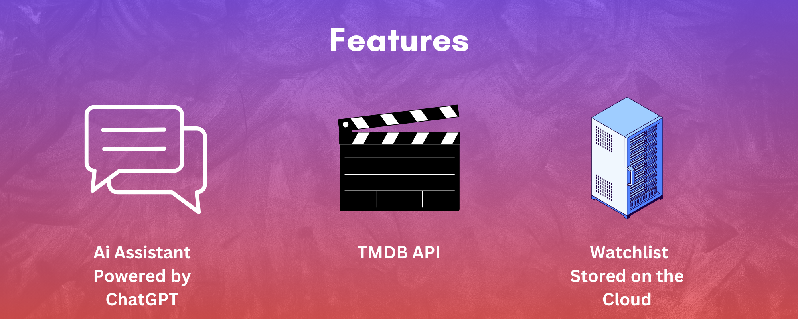
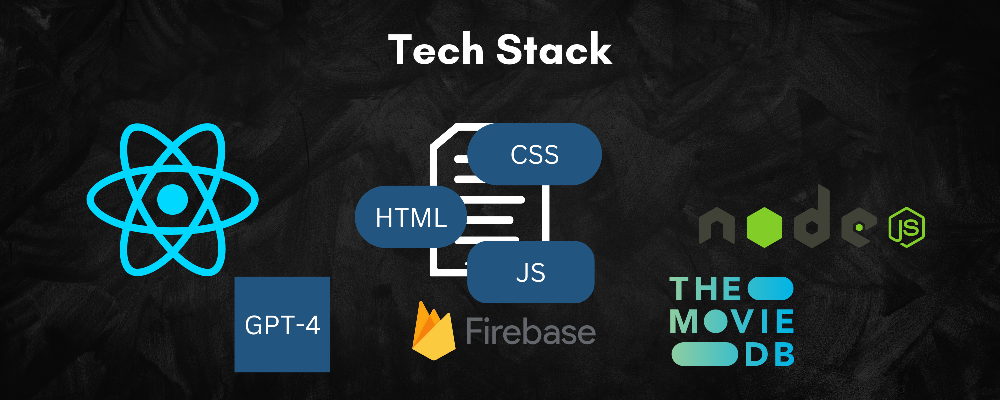

# Movidex

Movidex is your ultimate movie companion, designed to streamline your search for the perfect film and enhance your movie-watching experience.

## Inspiration

Movidex was born out of the frustration of endless scrolling through streaming platforms like Netflix, Prime Video, and Max. We aimed to create a solution that simplifies the process of finding your next favorite movie.

## Features

- **Curated Movie Lists**: Browse through various categories including movies currently in theaters, highly rated films, and upcoming releases.
- **Trailer Integration**: Watch YouTube video trailers for each movie directly within the app.
- **AI Assistant**: Chat with Stan, our trusty AI assistant, who can recommend movies based on your preferences and answer any movie-related questions.
- **Personalized Watchlist**: Maintain a personalized watchlist for future viewing.
- **Rating System**: Keep track of the movies you've watched with a personal rating system.

## Technology Stack

- **Frontend**: React
- **Styling**: CSS
- **Database**: Firebase Cloud Firestore
- **API**: TMDB (The Movie Database)
- **AI Integration**: ChatGPT 4 (OpenAI)

## Challenges Faced

- Overcoming API inconsistencies, such as receiving Arabic video keys despite specifying 'en-US' in queries.
- Managing complex event handling between components.

## Achievements

- Created a fully functional web application with user authentication and personalized features.
- Successfully integrated ChatGPT 4 to provide intelligent movie recommendations and answer user queries.
- Implemented efficient data storage and retrieval systems using Firebase.

## Lessons Learned

- Gained hands-on experience with the OpenAI module, customizing it to fit project-specific needs.
- Improved skills in React component management and state handling.
- Enhanced understanding of working with external APIs and handling their quirks.

## Future Plans

- Expand movie database and recommendation algorithms.
- Implement social features for sharing recommendations.
- Develop mobile applications for iOS and Android.
- Integrate with more streaming platforms for direct viewing options.

## Before Starting
- Install Nodejs on your device

## Getting Started
For a quick preview visit https://movidex.justinhennis.com

To build the project locally:
1. Clone the repository
2. At the root folder(movidex) run the following commands:
 `npm start` and `node ./movieserver.js` 
3. Enjoy :)

## License

This project is licensed under the [MIT License](LICENSE).

---

Created with ❤️ by Justin Hennis